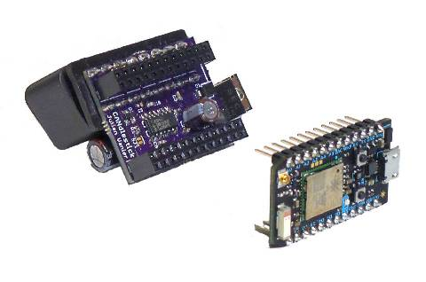
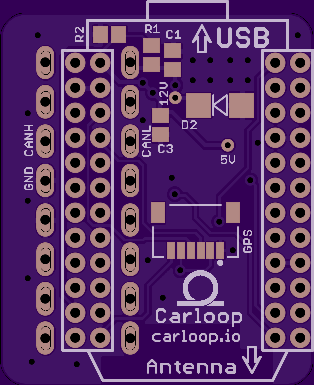

# [Carloop](https://www.carloop.io)
## OBD-II CAN adapter for the Particle Photon/Electron
**By Julien Vanier**

I wanted to make a compact internet-connected analyzer for my car's
OBD-II diagnostic port.

The WiFi-capable Particle Photon or better yet the cellular Particle
Electron are great options for that.

Luckily the pins for a Photon fits right in between the 2 rows of pins
of a straight OBD-II connector so it's possible to make a very compact
OBD-II adapter with a Photon.

# [Preorder one!](https://shop.trycelery.com/page/candlestick)

## Features

* High-speed CAN transceiver [adapted from the OpenXC project](https://github.com/openxc/reference-vi/blob/gh-pages/electrical/design/can.mkd)
* Get power from the OBD-II port using [a robust circuit adapted from the OpenXC project](https://github.com/openxc/reference-vi/blob/gh-pages/electrical/design/power.mkd)
* GPS connector
* Stacked components for a more compact development kit than a
traditional 90-degrees PCB mount OBD-II connector.
* Powered by the Particle platform!

## Images

PCB

Assembled adapter

* [With Photon](images/detail-photon.jpg)
* [With Electron](images/detail-electron.jpg)
* [Front view](images/detail-front.jpg)
* [Side view](images/detail-side.jpg)
* [Back view](images/detail-back.jpg)
* [Angle view](images/detail-angle.jpg)

## Hardware

Here are the PCB design files for the Revision 2.1

* [Schematic (PDF)](CANdlestick.v2/particle-can-v2.1.pdf)
  [(Eagle)](CANdlestick.v2/particle-can-v2.1.sch)
* [Layout (top)](CANdlestick.v2/particle-can-v2.1-layout-top.pdf)
  [(bottom)](CANdlestick.v2/particle-can-v2.1-layout-bottom.pdf)
  [(Eagle)](CANdlestick.v2/particle-can-v2.1.brd)
* [Bill of materials](particle-can-v2.1_BOM.csv)
* [OSH Park order page](https://oshpark.com/shared_projects/ir8I9vT6)

## Software

[I helped implement the CAN driver in the Photon and the Electron.](https://github.com/spark/firmware/pull/790/) I will see what I can do with it now!

*To be continued...*

## License

Copyright 2016 Julien Vanier

Licensed under the GPL v3
